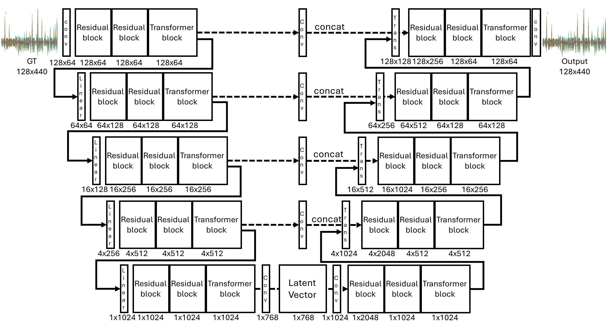
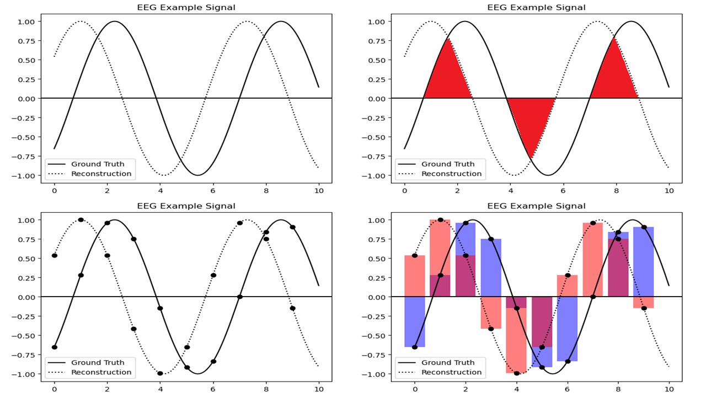

# EEG Representation Learning via Signal Dice Coefficient
In this paper, we investigate representation learning for acquiring condition matrices usable in the field of image generation based on electroencephalogram (EEG) signals. we employ the Signal Dice Coefficient, a new metric inspired by semantic segmentation techniques, for evaluation. The Signal Dice Coefficient effectively measures the fidelity of EEG representations and enhances performance when used as a loss metric. 


__Fig. Model Overview__


__Fig. Signal Dice Coeffiecient__

### Dice Coefficient(DSC)
Given two sets, X and Y, it is defined as

$$
DSC = \frac{|2X \cap Y|}{|X| + |Y|}
$$

When |X| and |Y| are the cardinalities of the two sets. Inspired by this concept, we adapted the perspective of viewing signals to employ the Dice Coefficient as a comparative metric between two signals. Simply put, if the integral difference between two signals is zero, they can be considered identical. Given two signals? functions $E(\cdot)$  and $R(\cdot)$, defined as

### Signal Dice Coefficient(SDSC)
$$
S(x) = E(x) \cdot R(x)
$$
$$
M(x) = \frac{\{(|E(x)| + |R(x)|) - ||E(x)| -|R(x)||\}}{2}
$$
$$
SDSC(t) = \frac{2 \times \int H(S(t)) \cdot M(t)\, dt}{ \int [E(t) + R(t)]\, dt }
$$

$H(\cdot)$ is Heaviside function, $t \in T$ is given time. our objective is to optimize $SDSC(\cdot)$ to 1. While straightforward, this concept poses challenges for the continuous and complex nature of EEG signals. EEG signals, characterized by their waveform patterns, are continuous and irregular yet always sampled at a constant rate. This means our data can be understood as continuous but discretely interpretable, necessitating a redefinition of the problem. Rather than calculating the integral difference between two signals, we can understand the task as making the sampled signals at the same moment have the same intensity. 


$$
SDSC(t) \approx SDSC(s) = \frac{2 \times \sum H(S(s)) \cdot M(s)\,}{ \sum (E(s) + R(s))\,}
$$


$s \in S$ represents discrete sampling points in time, then set $S \subset T$. $SDSC(s)$ can approximate $SDSC(t)$ from the observed values and is easier by converting integration into addition operations. Unlike MSE, SDSC depends on signal intensity, making it more sensitive to data peaks


## Intallation
```
pytorch > 2.1.0
opencv-python == 4.9.0.80
tensorboard==2.16.2
```

or using below
```cmd
pip install -r requirements.txt
```


## How to use


### Model Setting 

Model and train configuration see the [config file](./config/EEGAE_Train.json). if you want to different params, change it.

### Download Pretrained Model

we only provide MSE + SDSC w lambda 10 model [link]()

### TRAIN

```cmd
python train.py -c yourconfigpath -s sharedfilepath
```

basically we using only DDP on pytorch2 so, if you want to run on one gpu change [trainer](./trainer/) pls

#### TEST

```cmd
python test.py  -c yourconfigpath -s sharedfilepath
```
